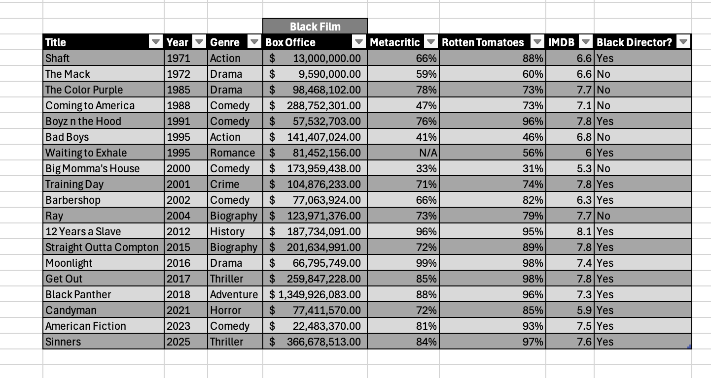
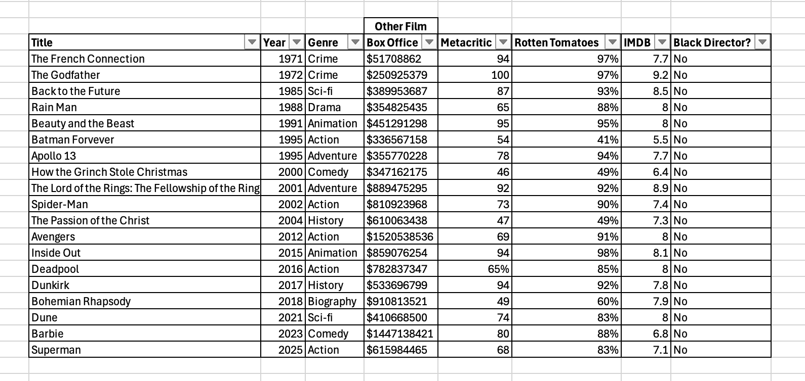
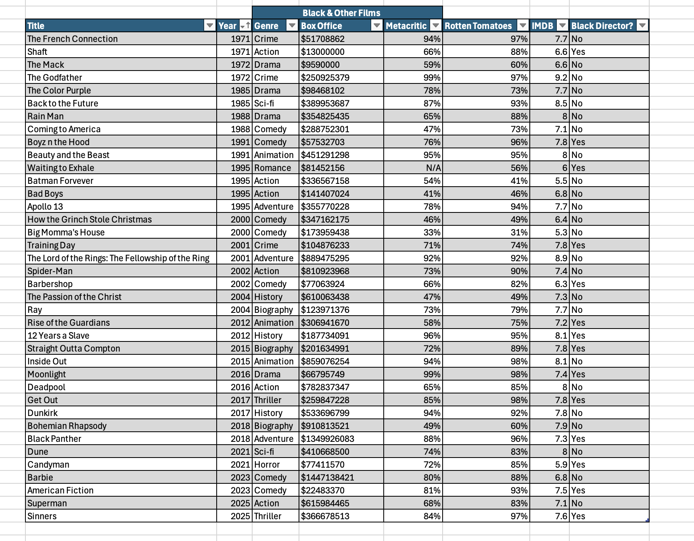
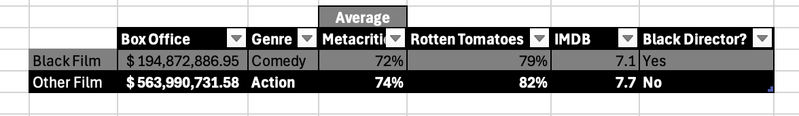

# 📊 Black Film - Is it truly growing? 
*A data analysis project based on the growth of black cinema and if black people are really able to compete with the way that film has been over the past decades*

## 📈 Task 1 - Black Film  
**📽️Black Film 1970s-2020s**  
- **Multiple genres** in order to get a full scope of black cinema.
- **Critic Reviews** in order to scale success not just box offices but quality.

**⚖️ Different Scales of Success**  
- 6 different scales: Year, Genre, Box Office, Metacritic, Rotten Tomatoes and IMDB.
- Another column for whether a film was director by a black director. As we are determining how "black" is a film if it's directed by a black director or not.

## 💹 Task 2 - Other Film
**🎞️Other Film 1970s-2020s**  
- **Multiple Genres** to mirror the table for Black Film
- **Critics Reviews** to get a view at the difference between black film reviews and other film reviews. 

## 📁 Task 3 - Other Film & Black Cinema 
**📹Combine the two to put into really see the difference in one table**  

## 🗂️ Task 4 - Averages
**📺Both Black & Other Film 1970s-2020s**  
- **Box Office** to get a look at the amount of people who showed up for black cinema compared to wider cinema
- **Critics Reviews** to get an average in the percentage given black cinema compared to wider cinema.
- **Genre** to know what genres do well in black cinema compared to genres that do well in wider cinema.

